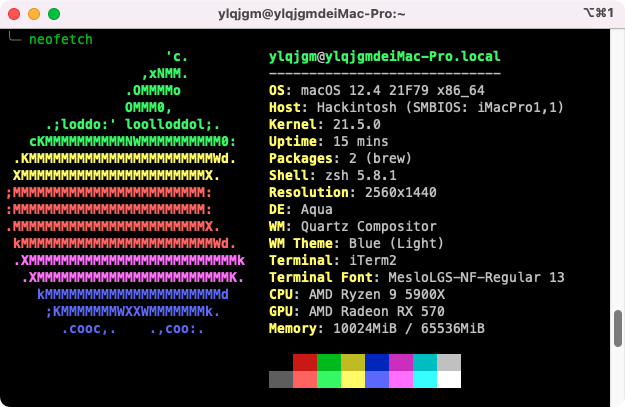

# R5900X-Asus-B550-A-EFI

## 硬件配置

| **名称** | **型号** |
| ------ | ------ |
| 处理器 | AMD Ryzen 9 5900X 12-Core |
| 主板 | 华硕 ROG STRIX B550-A GAMING（LPC Controller B550芯片组） |
| 显卡 | AMD Radeon RX 570 Series ( 8 GB / 华硕 ) |
| 内存 | 64 GB ( 英睿达 DDR4 3600MHz 16GB x 4 ) |
| 硬盘 | 三星 SSD 980 PRO 1TB (1 TB / 固态硬盘) |
| 声卡 | 瑞昱  @ AMD High Definition Audio 控制器 |
| 网卡 | Intel I255-V |
| 网卡 | 英特尔 82599 Dual 10 Gigabit Network Connection |
| 网卡 | RTL8111C |

## 软件配置

| **名称** | **版本** |
| ------ | ------ |
| MacOS | 12.4（Monterey） |
| OpenCore | 0.8.2 |
| SMBIOS | iMacPro1,1 |

## 运行说明

1. 网络正常不死机
2. VirtualBox正常运行
3. 苹果部分特色功能未测试
4. 万兆网卡需确保已更改pid，安装SmallTree驱动